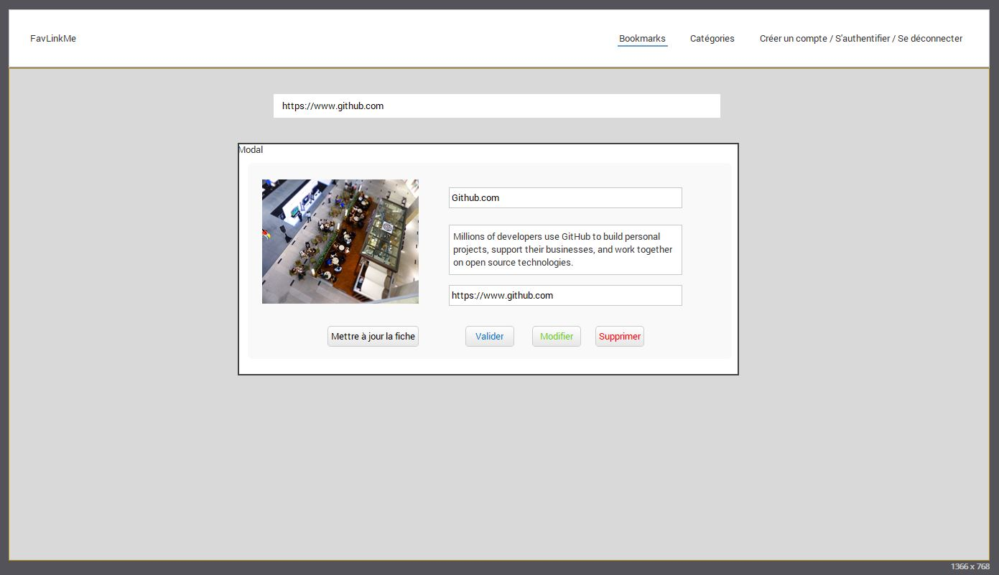

# FavLinkMe

## Planifier notre application

1. Questions à se poser
	- Qu'allons nous créer comme application ?
	- Pour qui allons nous créer cette application ?
	- De quelles fonctionnalités allons nous avoir besoin ?
2. Cas d'utilisations
3. Modélisation des Données
4. De quelles pages allons nous avoir besoin dans notre application ?

## Questions

1. Qu'allons nous créer comme application ?
Une application ou nous allons pouvoir gérer nos favoris avec catégorisation et récupération des informations du site mis en favoris. Les favoris des sites devront pouvoir se mettre à jour et avoir un système de vote (up, down - plus, moins) pour gérer leur pertinence. Il faut également que l'application gère les favoris non utilisés depuis plus d'un an pour les archiver. Des statistiques d'utilisation des liens doivent être possible.

2. Pour qui allons nous créer cette application ?
Nous créons cette application pour nous, mais aussi pour la communauté. N'importe qui pourra se créer un compte et gérer ses favoris.

3. De quelles fonctionnalités allons nous avoir besoin ?
	- Bookmarks
		- CRUD
		- Votes : plus, moins - up, down
		- Récupération des informations du site mis en favoris
	- Categories
		- CRUD
    - Association aux favoris
	- Contact
		- Formulaire de Contact
		- Sendgrid (si production sur Heroku)
	- User (Devise)

## Cas d'utilisations
En tant que **<=>**, je souhaite être capable de **<=>**, pour que **<=>**.
- En tant qu'utilisateur, je souhaite être capable de créer des bookmarks, pour gérer mes favoris.
- En tant qu'utilisateur, je souhaite être capable d'éditer et supprimer des bookmarks, pour que ce soit simple à administrer (la suppression archive le bookmark).
- En tant qu'utilisateur, je souhaite être capable d'assigner une catégorie aux bookmarks, pour que l'organisation soit plus simple.
- En tant qu'utilisateur, je souhaite être capable de voir les statistiques d'utilisation d'un bookmark, pour que les plus anciens soient mis aux archives.
- En tant qu'utilisateur, je souhaite être capable de voter pour ou contre un favoris afin de voir s'il est pertinent.
- En tant qu'utilisateur, je souhaite être capable de permettre aux visiteurs de me contacter par un formulaire sur mon site.

## Modélisation des Données

**Bookmark**
	- title:string
	- url:text

**Category**
	- title:string
	- description:text

**User**
	- gérés par Devise

## De quelles pages allons nous avoir besoin dans notre application ?

- Home
- Bookmarks#index
- Bookmarks#Show
- Categories#index
- Categories#show
- Contact

## Mise en production de l'application
Pour la mise en production le plus simple est [Heroku](https://www.heroku.com). Pour que cela soit possible, il faut installer plusieurs modules sur son PC (surtout sous Windows) :

### 1. Préparation de votre machine locale (si c'est sous Windows)
Installez les pré-requis suivants ([comme décrit sur cette page](https://devcenter.heroku.com/articles/getting-started-with-jruby#introduction)) :

- [Java Developement Toolkit 8](https://www.oracle.com/technetwork/java/javase/downloads/index.html)
- [JRuby 9.1.5.0](http://jruby.org/files/downloads/9.1.5.0/index.html)
- `jruby -S gem install bundler`

Puis installez l'interface Heroku en ligne de commande :
- [Heroku CLI](https://cli-assets.heroku.com/branches/stable/heroku-windows-amd64.exe)
- Validez l'installation avec `heroku login` (il vous est demandé votre émail et mot de passe de compte Heroku). Vous devriez voir `Logged in as #votreEmail`

### 2. Préparation de votre Application Rails
Il va falloir modifier votre Gemfile en ajoutant un groupe production comme suit :
<pre>
	<code>
			group :production do
			  gem 'pg'
			  gem 'rails_12factor'
			end
	</code>
</pre>

### 3. Envoie en production
Dès que vous êtes satisfait de votre code, il ne reste qu'à l'envoyer en production :
- `git add .`
- `git commit -am "Code prêt pour la production"`
- `git push`
- `git push heroku master`

Vous devriez voir la sortie suivante sur votre terminal :
<pre>
	<code>
		remote: Verifying deploy... done.
		To https://git.heroku.com/#nom_de_votre_app_heroku.git
		   b068051..2b0482c  master -> master
	</code>
</pre>

##ToDo
- Créer la maquette HTML
- Créer l'application rails
- Mettre en place le scrapping des sites
- ....

## Prototype

## Application en production
To be done
